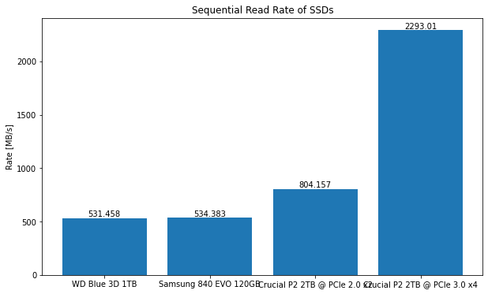

# CrystalDiskMark-Parser


Read in the .txt files generated by [CrystalDiskMark](https://en.wikipedia.org/wiki/CrystalDiskMark) in Python. 
This library was created to enable visualizing the benchmark results of 
[CrystalDiskMark](https://en.wikipedia.org/wiki/CrystalDiskMark) in an automated way. 
The following plot created with [matplotlib](https://pypi.org/project/matplotlib/) is an example.


## Install

```shell
pip install crystaldiskmark-parser
```
See https://pypi.org/project/crystaldiskmark-parser/ for more information.

## Overview

The library provides two Functions:
- `parse(filepath)`: Returns parsed data as a `crystaldiskmark_parser.BenchmarkResult`
- `parse_df(filepath)`: Returns parsed data as a `pandas.DataFrame`

Using `parse_df(filepath)` is recommended.


## Example 0: Print DataFrame

```python
from crystaldiskmark_parser.parser import parse_df

df = parse_df("../test/data/CrystalDiskMark_20210622162528 WD Blue 3D 1TB WDS100T2B0A.txt")
print(df)
```
### Output
```

                  date                              test  \
0  2021/06/22 17:19:21  1 GiB (x5) [E: 96% (894/932GiB)]   
1  2021/06/22 17:19:21  1 GiB (x5) [E: 96% (894/932GiB)]   
2  2021/06/22 17:19:21  1 GiB (x5) [E: 96% (894/932GiB)]   
3  2021/06/22 17:19:21  1 GiB (x5) [E: 96% (894/932GiB)]   
4  2021/06/22 17:19:21  1 GiB (x5) [E: 96% (894/932GiB)]   
5  2021/06/22 17:19:21  1 GiB (x5) [E: 96% (894/932GiB)]   
6  2021/06/22 17:19:21  1 GiB (x5) [E: 96% (894/932GiB)]   
7  2021/06/22 17:19:21  1 GiB (x5) [E: 96% (894/932GiB)]   

                             time                                    os  \
0  Measure 5 sec / Interval 5 sec  Windows 10  [10.0 Build 19042] (x64)   
1  Measure 5 sec / Interval 5 sec  Windows 10  [10.0 Build 19042] (x64)   
2  Measure 5 sec / Interval 5 sec  Windows 10  [10.0 Build 19042] (x64)   
3  Measure 5 sec / Interval 5 sec  Windows 10  [10.0 Build 19042] (x64)   
4  Measure 5 sec / Interval 5 sec  Windows 10  [10.0 Build 19042] (x64)   
5  Measure 5 sec / Interval 5 sec  Windows 10  [10.0 Build 19042] (x64)   
6  Measure 5 sec / Interval 5 sec  Windows 10  [10.0 Build 19042] (x64)   
7  Measure 5 sec / Interval 5 sec  Windows 10  [10.0 Build 19042] (x64)   

      mode  profile         comment read_write type  blocksize unit_blocksize  \
0  [Admin]  Default  WD Blue 3D 1TB       read  SEQ        1.0            MiB   
1  [Admin]  Default  WD Blue 3D 1TB       read  SEQ        1.0            MiB   
2  [Admin]  Default  WD Blue 3D 1TB       read  RND        4.0            KiB   
3  [Admin]  Default  WD Blue 3D 1TB       read  RND        4.0            KiB   
4  [Admin]  Default  WD Blue 3D 1TB      write  SEQ        1.0            MiB   
5  [Admin]  Default  WD Blue 3D 1TB      write  SEQ        1.0            MiB   
6  [Admin]  Default  WD Blue 3D 1TB      write  RND        4.0            KiB   
7  [Admin]  Default  WD Blue 3D 1TB      write  RND        4.0            KiB   

  queues threads     rate unit_rate     iops unit_iops   latency unit_latency  
0      8       1  531.458      MB/s    506.8      IOPS  15726.77           us  
1      1       1  489.838      MB/s    467.1      IOPS   2139.41           us  
2     32       1  269.406      MB/s  65772.9      IOPS    470.58           us  
3      1       1   41.375      MB/s  10101.3      IOPS     98.75           us  
4      8       1  498.656      MB/s    475.6      IOPS  16750.30           us  
5      1       1  485.163      MB/s    462.7      IOPS   2159.18           us  
6     32       1  222.691      MB/s  54367.9      IOPS    583.02           us  
7      1       1   99.900      MB/s  24389.6      IOPS     40.73           us  
```
## Example 1: Visualize benchmark results

```python
from crystaldiskmark_parser.parser import parse_df
import matplotlib.pyplot as plt

#  Read to one big DataFrame
df = parse_df("../test/data/CrystalDiskMark_20210622162528 WD Blue 3D 1TB WDS100T2B0A.txt")
df = df.append(parse_df("../test/data/CrystalDiskMark_20210622163451 SAMSUNG 840 EVO 120GB.txt"))
df = df.append(parse_df("../test/data/CrystalDiskMark_20210626154221 Crucial P2 2TB on H87M.txt"))
df = df.append(parse_df("../test/data/CrystalDiskMark_20210627172807 Crucial P2 2TB on X370.txt"))
print(df.info())

# Extract relevant rows
data = df.loc[(df['read_write'] == 'read')
              & (df['type'] == "SEQ")
              & (df['queues'] == 8)
              & (df['blocksize'] == 1)
              & (df['unit_blocksize'] == "MiB")]

# Extract relevant columns
rate = data["rate"]
name = data["comment"]

# Plot
fig, ax = plt.subplots(figsize=(10, 6))
con = ax.bar(name, rate)
ax.bar_label(con)
ax.set_title("Sequential Read Rate of SSDs")
ax.set_ylabel("Rate [MB/s]")
plt.show()
```




## Example 2: Visualize benchmark results (extended)

```python

from crystaldiskmark_parser.parser import parse_df

import matplotlib.pyplot as plt


#%%
# Read to one big DataFrame
df = parse_df("../test/data/CrystalDiskMark_20210622162528 WD Blue 3D 1TB WDS100T2B0A.txt")
df = df.append(parse_df("../test/data/CrystalDiskMark_20210622163451 SAMSUNG 840 EVO 120GB.txt"))
df = df.append(parse_df("../test/data/CrystalDiskMark_20210626154221 Crucial P2 2TB on H87M.txt"))
df = df.append(parse_df("../test/data/CrystalDiskMark_20210627172807 Crucial P2 2TB on X370.txt"))

# Extract relevant rows
data = df.loc[(df['read_write'] == 'read')
              & (df['type'] == "SEQ")
              & (df['queues'] == 8)
              & (df['blocksize'] == 1)
              & (df['unit_blocksize'] == "MiB")]

# Extract relevant columns
read_rate = data["rate"]
read_rate = [round(x) for x in read_rate]
name = data["comment"]

# Extract relevant rows
data = df.loc[(df['read_write'] == 'write')
              & (df['type'] == "SEQ")
              & (df['queues'] == 8)
              & (df['blocksize'] == 1)
              & (df['unit_blocksize'] == "MiB")]

# Extract relevant columns
write_rate = data["rate"]
write_rate = [round(x) for x in write_rate]

# Plot
fig, ax = plt.subplots(figsize=(12, 6))
con = ax.bar([float(x)  + .25 for x in  range(len(read_rate))], read_rate, tick_label=name, width = 0.25)
ax.bar_label(con)
con = ax.bar([float(x)  + .5 for x in  range(len(write_rate))], write_rate, width = 0.25)
ax.bar_label(con)
ax.set_title("Sequential Read & Write Rate of SSDs")
ax.set_ylabel("Rate [MB/s]")
plt.legend(["read", "write"])
plt.show()
```


## Example 3: Visualize benchmark results (without DataFrame)

```python

from crystaldiskmark_parser.parser import parse
import matplotlib.pyplot as plt

result_wd = parse("data/CrystalDiskMark_20210622162528 WD Blue 3D 1TB WDS100T2B0A.txt")
result_samsung = parse("data/CrystalDiskMark_20210622163451 SAMSUNG 840 EVO 120GB.txt")

data = [result_wd.read_results[0].rate, result_samsung.read_results[0].rate]

fig, ax = plt.subplots(figsize=(10,6))
con = ax.bar(["WD Blue 3D 1TB", "Samsung 840 EVO 120GB"], data)
ax.bar_label(con)
ax.set_title("Read Rate of SSDs")
ax.set_ylabel(f"Rate [{result_wd.read_results[0].unit_rate}]")
plt.show()
```


## Example 4: Print BenchmarkResult

```python
from crystaldiskmark_parser.parser import parse

benchmark_result = parse("data/CrystalDiskMark_20210622162528 WD Blue 3D 1TB WDS100T2B0A.txt")
print(benchmark_result)
```

### Output

```
BenchmarkResult({'test': '1 GiB (x5) [E: 96% (894/932GiB)]', 'date': '2021/06/22 17:19:21', 'os': 'Windows 10  [10.0 Build 19042] (x64)', 'profile': 'Default', 'time': 'Measure 5 sec / Interval 5 sec', 'mode': '[Admin]', 'comment': 'WD Blue 3D 1TB WDS100T2B0A', 'write_results': [TestResult({'test_type': 'SEQ', 'block_size': 1.0, 'unit_block_size': 'MiB', 'queues': 8, 'threads': 1, 'rate': 498.656, 'unit_rate': 'MB/s', 'iops': 475.6, 'unit_iops': 'IOPS', 'latency': 16750.3, 'unit_latency': 'us'}), TestResult({'test_type': 'SEQ', 'block_size': 1.0, 'unit_block_size': 'MiB', 'queues': 1, 'threads': 1, 'rate': 485.163, 'unit_rate': 'MB/s', 'iops': 462.7, 'unit_iops': 'IOPS', 'latency': 2159.18, 'unit_latency': 'us'}), TestResult({'test_type': 'RND', 'block_size': 4.0, 'unit_block_size': 'KiB', 'queues': 32, 'threads': 1, 'rate': 222.691, 'unit_rate': 'MB/s', 'iops': 54367.9, 'unit_iops': 'IOPS', 'latency': 583.02, 'unit_latency': 'us'}), TestResult({'test_type': 'RND', 'block_size': 4.0, 'unit_block_size': 'KiB', 'queues': 1, 'threads': 1, 'rate': 99.9, 'unit_rate': 'MB/s', 'iops': 24389.6, 'unit_iops': 'IOPS', 'latency': 40.73, 'unit_latency': 'us'})], 'read_results': [TestResult({'test_type': 'SEQ', 'block_size': 1.0, 'unit_block_size': 'MiB', 'queues': 8, 'threads': 1, 'rate': 531.458, 'unit_rate': 'MB/s', 'iops': 506.8, 'unit_iops': 'IOPS', 'latency': 15726.77, 'unit_latency': 'us'}), TestResult({'test_type': 'SEQ', 'block_size': 1.0, 'unit_block_size': 'MiB', 'queues': 1, 'threads': 1, 'rate': 489.838, 'unit_rate': 'MB/s', 'iops': 467.1, 'unit_iops': 'IOPS', 'latency': 2139.41, 'unit_latency': 'us'}), TestResult({'test_type': 'RND', 'block_size': 4.0, 'unit_block_size': 'KiB', 'queues': 32, 'threads': 1, 'rate': 269.406, 'unit_rate': 'MB/s', 'iops': 65772.9, 'unit_iops': 'IOPS', 'latency': 470.58, 'unit_latency': 'us'}), TestResult({'test_type': 'RND', 'block_size': 4.0, 'unit_block_size': 'KiB', 'queues': 1, 'threads': 1, 'rate': 41.375, 'unit_rate': 'MB/s', 'iops': 10101.3, 'unit_iops': 'IOPS', 'latency': 98.75, 'unit_latency': 'us'})]})
```


## Development

### Build and Publish a New Release

This repository has a GH Actions CI/CD pipeline that handle building and publishing the package to PyPI.
It is triggered by a commit or pull request on `main` branch. 

#### Steps to publish a new release:

1. Check if the version number is correctly set in `setup.py` and `__init__.py`
2. Create a new pull request from `dev` branch to `main` branch. Accept this pull request
3. Wait until the _test_ GH workflow ends and succeeds
4. Create a new *Release* in GitHub. Set the version number as the name
5. Wait until the _publish_ GH workflow ends and succeeds
6. Check if package is available on [PyPI](https://pypi.org/project/crystaldiskmark-parser/)
